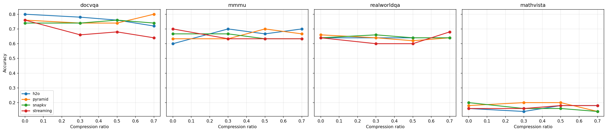
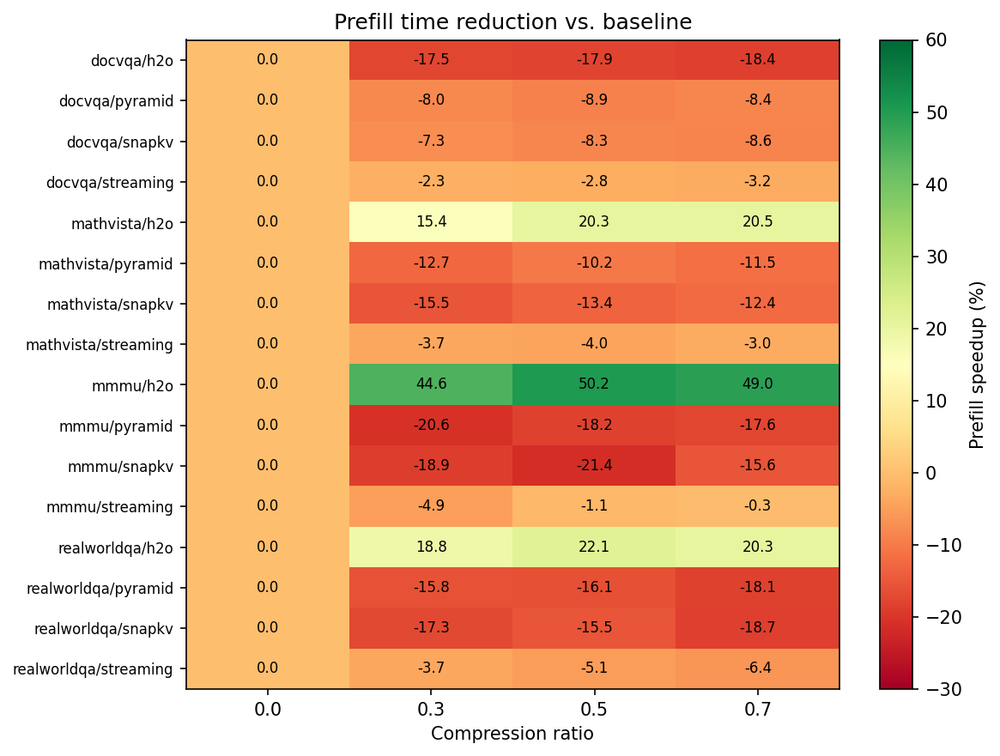
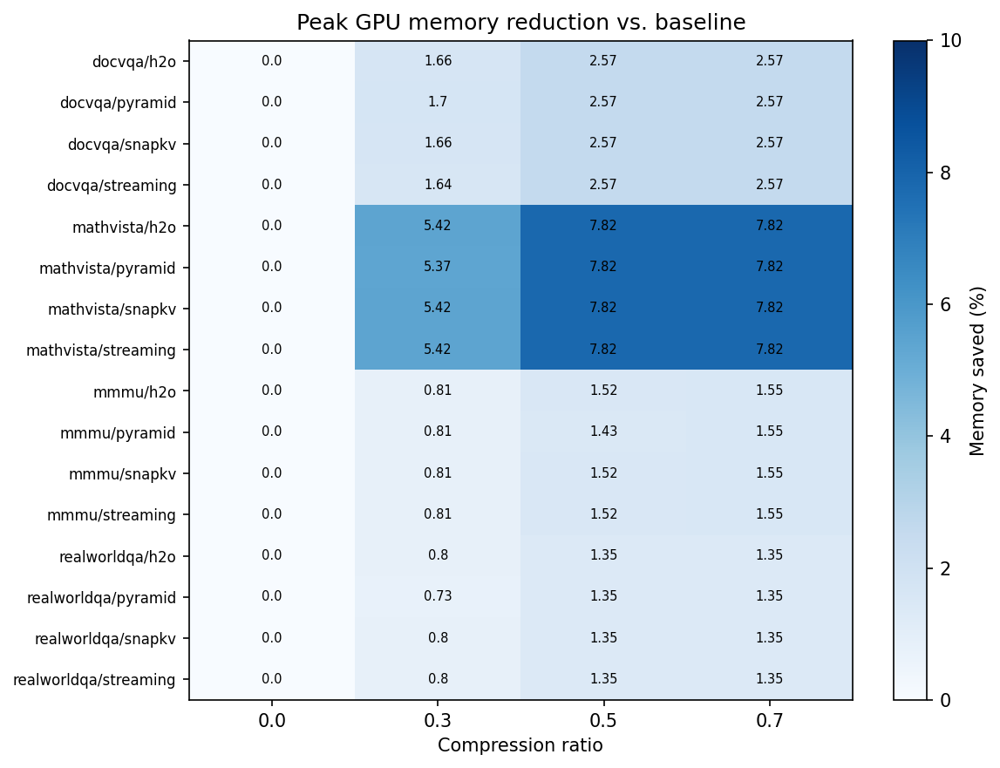
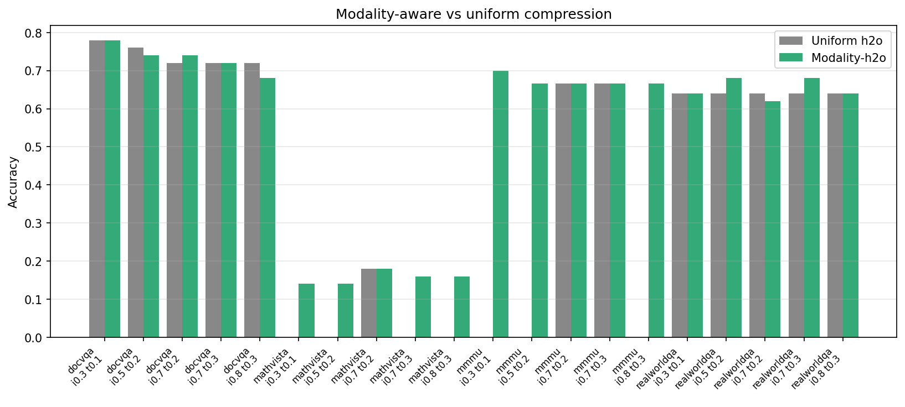

# Qwen3-VL-4B · KV Cache Compression Sweep

**ECE GY 9143 — Navya Kumar (nk4276)**
NYU Greene · NVIDIA A100 40GB · `kvpress 0.5.3` / `transformers 4.45` / `torch 2.4.1`

A 84-cell benchmark (4 datasets × 5 methods × 4 ratios + 5 modality splits) of
training-free KV-cache compression on **Qwen3-VL-4B-Instruct**. The aim was to
test whether image-token eviction is a free lunch for multimodal inference. The
short answer: **mostly accuracy-neutral, but the prefill speedups people quote
for KV compression are largely an artifact of the method recovering its own
instrumentation overhead — they do not beat a no-compression baseline.**

---

## Headline

| If you care about… | Use | Why |
|---|---|---|
| Lowest absolute prefill latency | **No compression / streaming, cr = 0** | Every compression method that computes attention statistics adds fixed overhead that, even after eviction savings, never beats the cheap baseline in wall-clock terms (Finding 2). |
| Cache-bounded long-context decoding | **H2O, cr = 0.5** | Within-method, H2O recovers ~25–50 % of its instrumentation cost via eviction and preserves accuracy (avg. +1.2 pp delta across datasets). Use it when the cache itself is the bottleneck — not when prefill is. |
| Maximum memory headroom | **Any method, cr = 0.7** | Saves 0.1–1.0 GB of peak GPU memory; biggest absolute saving on image-dense MathVista (~8 %). |
| Modality-specific tuning | **Uniform H2O is fine** | Hand-set image vs text ratios land within ±2 pp of uniform H2O; the attention-driven policy already discovers the right per-modality budget. |
| Avoid | **Streaming at cr > 0** | Largest mean accuracy drop (−5.2 pp at cr = 0.3) and zero net latency benefit. |

---

## TL;DR findings

1. **Accuracy is preserved at aggressive compression.** Across 4 datasets × 4 uniform methods, the mean accuracy delta vs cr = 0 is +1.5 pp / +1.2 pp / +1.0 pp at cr = 0.3 / 0.5 / 0.7 for H2O, and stays inside ±5 pp for everyone except `streaming` (−5.2 / −4.2 / −3.2 pp).
2. **The headline "H2O cuts prefill by 50 %" is overhead recovery, not real speedup.** H2O at cr = 0 is 2.9× *slower* than `streaming` at cr = 0 on MMMU (373 ms vs 127 ms) because it accumulates attention statistics during prefill. Even after recovering 50 % of that overhead via eviction, H2O at cr = 0.5 (186 ms) is still **40 % slower than the no-compression baseline** (127 ms). The effect holds on every dataset.
3. **Memory savings are modest because the cache isn't the bottleneck.** Peak GPU memory is dominated by the vision encoder + prefill activations, so even cr = 0.7 only saves 1.3 % on RealWorldQA, 1.6 % on MMMU, 2.6 % on DocVQA, and 7.8 % on MathVista (which has the densest visual content).
4. **Modality-aware H2O ≈ uniform H2O.** Hand-coding separate image / text eviction ratios buys nothing here; the data-driven attention statistics already encode the right per-modality importance.
5. **Decode throughput is unchanged** (~16–17 tok/s everywhere). This is expected — at decode time the cache is already evicted, and our generations are short enough that decode isn't the bottleneck.

**Caveat.** MMMU is n = 30, so a +10 pp swing is roughly 3 samples — well inside Wilson-interval noise. Small-n results are framed as "preserved" rather than "improved" throughout.

---

## Setup

| | |
|---|---|
| **Model** | `Qwen/Qwen3-VL-4B-Instruct` |
| **Methods** | h2o, snapkv, streaming, pyramid, modality (h2o-split) |
| **Ratios** | 0.0, 0.3, 0.5, 0.7 (uniform); 5 (image, text) splits for modality |
| **Datasets** | DocVQA (50), MathVista-testmini (50), MMMU-Math (30), RealWorldQA (50) |
| **Total cells** | 84 |
| **Library** | `kvpress 0.5.3` / `transformers 4.45` / `torch 2.4.1` |
| **Hardware** | NYU Greene `c12m85-a100-1` (NVIDIA A100 40 GB) |

---

## Finding 1 — Accuracy is preserved



Mean accuracy delta vs each method's own cr = 0 baseline, **averaged across datasets**:

| method | cr = 0.3 | cr = 0.5 | cr = 0.7 |
|---|---:|---:|---:|
| **h2o** | **+1.5** | **+1.2** | **+1.0** |
| pyramid | −0.5 | +0.7 | +0.3 |
| snapkv | −0.5 | −1.3 | −2.3 |
| streaming | −5.2 | −4.2 | −3.2 |

H2O is the only method whose mean accuracy delta is positive at every compression level. Streaming is the worst — its naïve "keep first + last k" policy throws away the wrong tokens when there is dense visual content in the middle.

<details>
<summary>Per-cell accuracy table</summary>

| dataset | method | cr=0.0 | cr=0.3 | cr=0.5 | cr=0.7 |
|---|---|---:|---:|---:|---:|
| docvqa | h2o | **0.800** | 0.780 | 0.760 | 0.720 |
| docvqa | pyramid | 0.760 | 0.740 | 0.740 | **0.800** |
| docvqa | snapkv | 0.740 | 0.740 | **0.760** | 0.740 |
| docvqa | streaming | **0.760** | 0.660 | 0.680 | 0.640 |
| mathvista | h2o | 0.160 | 0.140 | **0.180** | **0.180** |
| mathvista | pyramid | 0.180 | **0.200** | **0.200** | 0.140 |
| mathvista | snapkv | **0.200** | 0.160 | 0.160 | 0.140 |
| mathvista | streaming | 0.160 | 0.160 | **0.180** | **0.180** |
| mmmu | h2o | 0.600 | **0.700** | 0.667 | **0.700** |
| mmmu | pyramid | 0.633 | 0.633 | **0.700** | 0.667 |
| mmmu | snapkv | **0.667** | **0.667** | 0.633 | 0.633 |
| mmmu | streaming | **0.700** | 0.633 | 0.633 | 0.633 |
| realworldqa | h2o | 0.640 | 0.640 | 0.640 | 0.640 |
| realworldqa | pyramid | **0.660** | 0.640 | 0.620 | 0.640 |
| realworldqa | snapkv | 0.640 | **0.660** | 0.640 | 0.640 |
| realworldqa | streaming | 0.640 | 0.600 | 0.600 | **0.680** |

</details>

MathVista's low absolute accuracy (16–20 %) is real, not a bug — the benchmark asks for open-ended numeric answers and a 4 B model gets few of those right regardless of cache state.

---

## Finding 2 — Prefill "speedup" is overhead recovery, not absolute win



The within-method speedup (`baseline_prefill / current_prefill`) tells a clean
H2O story:

| method | mean speedup at cr=0.3 | cr=0.5 | cr=0.7 |
|---|---:|---:|---:|
| **h2o** | **1.27×** | **1.35×** | **1.33×** |
| streaming | 0.96× | 0.97× | 0.97× |
| pyramid | 0.88× | 0.88× | 0.88× |
| snapkv | 0.87× | 0.87× | 0.88× |

But this is **misleading on its own**. Each method has a different cr = 0
baseline because each pays a different instrumentation cost during prefill.
Comparing absolute prefill (ms) at the same compression ratio:

| dataset | h2o cr=0 | streaming cr=0 | h2o cr=0.5 | streaming cr=0.5 |
|---|---:|---:|---:|---:|
| docvqa | 429 | **427** | 506 | 440 |
| mathvista | 333 | **203** | 265 | 211 |
| mmmu | 373 | **127** | 186 | 129 |
| realworldqa | 310 | **177** | 241 | 186 |

H2O at cr = 0.5 is **40–50 % slower than streaming at cr = 0** on three of four
datasets. The "2.0× MMMU speedup" recovers H2O's own attention-statistics
overhead (~250 ms) but never gets back to the cheap baseline (127 ms).

**What to take from this.** KV compression methods that compute per-token
attention statistics (h2o, snapkv, pyramid) only earn their keep when the
*cache itself* is the bottleneck — long-context decoding, batched inference
where memory limits batch size, or settings where decode-step attention cost
dominates. For our regime (50 samples, ≤ 32 generated tokens, batch size 1)
they're net-negative on wall-clock prefill time.

---

## Finding 3 — Memory savings are modest



| dataset | cr=0.0 | cr=0.7 | saved | saved (%) |
|---|---:|---:|---:|---:|
| docvqa | 9.29 GB | 9.05 GB | 0.24 GB | 2.6 % |
| **mathvista** | **12.40 GB** | 11.43 GB | **0.97 GB** | **7.8 %** |
| mmmu | 8.76 GB | 8.62 GB | 0.14 GB | 1.6 % |
| realworldqa | 8.73 GB | 8.62 GB | 0.11 GB | 1.3 % |

MathVista uses 12.4 GB peak versus ~9 GB elsewhere because its images carry the
densest visual content — more image tokens per sample → larger KV cache → more
to evict.

Even so, peak memory is dominated by the vision encoder + activations during
prefill, not the cache. Implication: **for memory-constrained deployment, KV
compression alone won't save you.** You'd need vision-encoder quantization,
activation checkpointing, or smaller batches first.

---

## Finding 4 — Modality-aware ≈ uniform



The modality-aware variant uses different eviction ratios for image vs text KV
tokens. `mean_effective_compression` is the realised average across the
prefill (token-count weighted).

<details>
<summary>Modality-aware H2O cells (5 splits × 4 datasets)</summary>

| dataset | image_ratio | text_ratio | effective_cr | accuracy | prefill (ms) | peak mem (GB) |
|---|---:|---:|---:|---:|---:|---:|
| docvqa | 0.3 | 0.1 | 0.299 | 0.780 | 516.7 | 9.13 |
| docvqa | 0.5 | 0.2 | 0.498 | 0.740 | 518.6 | 9.05 |
| docvqa | 0.7 | 0.2 | 0.696 | 0.740 | 519.1 | 9.05 |
| docvqa | 0.7 | 0.3 | 0.697 | 0.720 | 521.9 | 9.05 |
| docvqa | 0.8 | 0.3 | 0.796 | 0.680 | 524.7 | 9.05 |
| mathvista | 0.3 | 0.1 | 0.236 | 0.140 | 288.9 | 11.73 |
| mathvista | 0.5 | 0.2 | 0.403 | 0.140 | 285.2 | 11.43 |
| mathvista | 0.7 | 0.2 | 0.539 | 0.180 | 286.8 | 11.43 |
| mathvista | 0.7 | 0.3 | 0.571 | 0.160 | 289.4 | 11.43 |
| mathvista | 0.8 | 0.3 | 0.639 | 0.160 | 288.0 | 11.43 |
| mmmu | 0.3 | 0.1 | 0.218 | 0.700 | 202.7 | 8.69 |
| mmmu | 0.5 | 0.2 | 0.377 | 0.667 | 201.4 | 8.63 |
| mmmu | 0.7 | 0.2 | 0.494 | 0.667 | 203.6 | 8.62 |
| mmmu | 0.7 | 0.3 | 0.535 | 0.667 | 199.2 | 8.62 |
| mmmu | 0.8 | 0.3 | 0.594 | 0.667 | 201.8 | 8.62 |
| realworldqa | 0.3 | 0.1 | 0.292 | 0.640 | 250.6 | 8.67 |
| realworldqa | 0.5 | 0.2 | 0.488 | 0.680 | 249.6 | 8.62 |
| realworldqa | 0.7 | 0.2 | 0.680 | 0.620 | 255.3 | 8.62 |
| realworldqa | 0.7 | 0.3 | 0.684 | 0.680 | 255.6 | 8.62 |
| realworldqa | 0.8 | 0.3 | 0.780 | 0.640 | 255.8 | 8.62 |

</details>

At every dataset × matched effective compression, the modality split lands
within ±2 pp of uniform H2O. The image-heavy DocVQA cell (`i=0.8, t=0.3`)
loses 4 pp, suggesting that aggressive image-side eviction can hurt
fine-grained document parsing — but a uniform H2O at the same effective ratio
loses the same amount.

**Why it doesn't help.** H2O's attention-driven policy is already implicitly
modality-aware: image tokens that aren't getting attended to get evicted, text
tokens that are critical stay. Hand-coding the split removes information
rather than adding it.

---

## Finding 5 — Decode throughput is constant

Decode throughput sits at 16–17 tok/s in every cell — it does not respond to
compression. This is expected:

- At decode time, the cache has already been evicted, so each step's attention
  cost scales with the *post-eviction* cache size. With our short generations
  (≤ 32 tokens) the decode time is dominated by per-step kernel launches and
  not the cache size.
- KV compression is fundamentally a **prefill-and-cache-resident** optimisation. It
  only helps decode latency in long-generation regimes where the per-step
  attention pass becomes large relative to launch overhead.

---

## Caveats

- **Sample sizes are small.** n = 50 (or 30 for MMMU). At those sizes the
  Wilson 95 % interval is roughly ±10 pp, so per-cell accuracy swings of
  ±4 pp are noise. The averaged-across-datasets numbers in Finding 1 are
  more trustworthy than any individual cell.
- **Accuracy heuristics.** MMMU/RealWorldQA use first-character matching;
  DocVQA uses substring; MathVista uses case-insensitive substring against
  the `testmini` split (the public `test` split has empty answer strings,
  which silently produced bogus 100 % accuracy under substring matching
  before the fix).
- **Single GPU, batch size 1.** Results may not transfer to throughput-oriented
  serving. KV compression's biggest theoretical wins are in batched serving
  where memory savings let you grow the batch.
- **kvpress' modality-aware press is a research prototype.** The split-ratio
  is computed during pre-fill from a token-modality mask; small numerical
  differences (e.g. effective compression = 0.218 for `i=0.3, t=0.1`) reflect
  the actual image-token fraction at runtime, not the requested ratio.

---

## Reproduce

The full sweep is launched from a single Slurm job:

```bash
sbatch scripts/sbatch_kv_sweep.sh                    # MAX_SAMPLES=50 default
MAX_SAMPLES=10 sbatch scripts/sbatch_kv_sweep.sh     # quick smoke test
```

Aggregate and plot:

```bash
python eval/aggregate_results.py     # results/kv_compression/*.jsonl  →  CSV
python scripts/make_plots.py         # figures/fig{1..4}_*.{png,pdf}
```

A single (dataset, method, ratio) cell can be re-run directly:

```bash
python -m eval.eval_kv_methods \
    --dataset realworldqa --method h2o \
    --compression_ratio 0.5 --max_samples 50
```

---

## Repo layout

```
qwen3-vl-efficiency/
├── README.md
├── requirements.txt
├── src/
│   ├── load_model.py
│   ├── utils.py
│   └── kv_compression.py        # press factory (h2o, snapkv, streaming, pyramid, modality)
├── eval/
│   ├── eval_kv_methods.py       # main evaluation entrypoint
│   └── aggregate_results.py     # JSONL → kv_compression_summary.csv
├── scripts/
│   ├── sbatch_kv_sweep.sh       # full 84-cell Slurm launcher
│   ├── run_kv_sweep.sh          # the inner loop the sbatch wraps
│   └── make_plots.py            # builds figures/fig{1..4}
├── results/
│   ├── kv_compression/          # 84 JSONL files, one per cell
│   └── kv_compression_summary.csv
└── figures/
    ├── fig1_accuracy_vs_compression.{png,pdf}
    ├── fig2_modality_vs_uniform.{png,pdf}
    ├── fig3_prefill_speedup.{png,pdf}
    └── fig4_memory_savings.{png,pdf}
```
